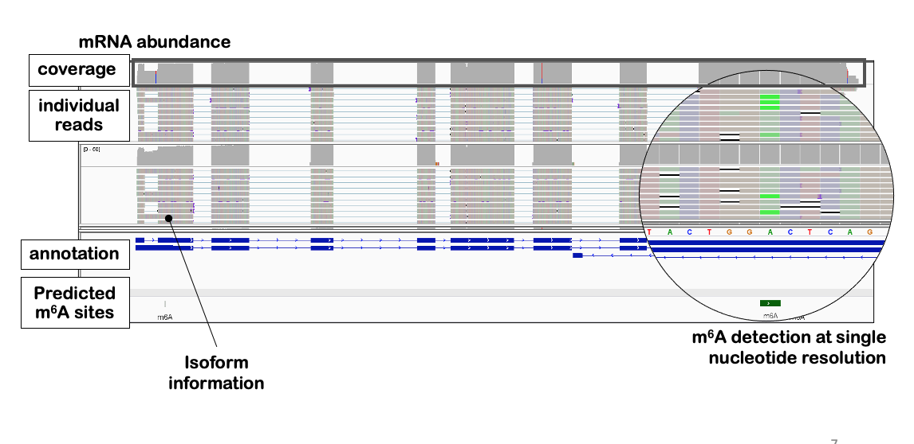

# m6ABasecaller

The m6A basecaller allows to directly base-call RNA modifications from direct RNA sequencing nanopore raw FAST5 files. 





## Table of contents
- [General Description](#General-description)
- [Installation](#Installation)
- [Running the code](#Running-the-code)
	- [1. Basecalling with m6A basecalling model](#1-basecalling-with-m6A-basecalling-model)
	- [2. Processing ModPhred output](#2-processing-modphred-output)
- [Dependencies and versions](#Dependencies-and-versions)
- [Citation](#Citation) 
- [Contact](#Contact) 


## General Description
The m6A basecaller uses an RNA basecalling model that predicts 5 nucleosides (A,C,G,U,m6A) compared to canonical RNA basecalling models, which give as output 4 nuclesodies (A,C,G,U). 

The RNA basecalling model can be used directly with Guppy. Alternatively, it can be fed to [ModPhred](https://modphred.readthedocs.io/en/latest/), which facilitiates the storage and downstream analysis of RNA modification data from nanopore sequencing datasets. 

This repo includes command line examples and scripts to: 
* 1. Use the m6A-modification-aware RNA basecalling model (which we term, for simplicity, **m6ABasecaller**). 
* 2. Analyze the output generated by modPhred (ie. the RNA modification information that was extracted by modPhred). 


## Installation 

Please follow the instructions on how to install modPhred [here](https://modphred.readthedocs.io/en/latest/install.html).

## Running the code

### 1. Basecalling with m6A basecalling model

#### a) Option 1 --  All-in-one step solution: Base-call, store modification information and map with ModPhred (recommended option)
Here we use the tool [ModPhred](https://github.com/novoalab/modPhred) to base-call, encode m6A RNA modification and map the reads in a simple, and efficient manner, with a single command, making it very simple for the user to use alternative basecalling models.  ModPhred performs the base-calling step using Guppy. The data is stored both in the FASTQ and BAM files, in the QUALITY INFORMATION. 

Usage: 
```
-c: config for guppy, containing the m6A basecaller model. (for m6A basecaller: rna_r9.4.1_70bps_m6A_hac.cfg)
--host: path to your guppy_basecall_server
-f: your reference.fa file
-o: path to output folder
-i: path to input folders (containing the fast5 files). You can provide >=1 input folders

module load Singularity/3.2.1
singularity exec --nv modPhred/modphred-3.6.1.sif modPhred/run -c ont-guppy/data/rna_r9.4.1_70bps_m6A_hac.cfg --host soft/ont-guppy/bin/guppy_basecall_server -f reference.fa -o m6A_basecaller -i path/to/sample1  path/to/sample2  path/to/sample3 

```

For more details on how to use ModPhred, please see the [GitHub](https://github.com/novoalab/modPhred) repository and the [ReadTheDocs](https://modphred.readthedocs.io/en/latest/install.html) manual.

#### b) Option 2 -- Base-call with Guppy 
You may use this model standalone with Guppy, and then use megalodon or ModPhred to extract and process the RNA modification information. Please note that if you use megalodon, your RNA modification information will be encoded in the form of SAM tags. If you use ModPhred, your RNA modification information will be encoded in the quality of the FASTQ and BAM. (future version of ModPhred will allow to encode modification information directly in SAM tags). 

Usage: 
```
guppy_basecaller –i path/to/sample/fast5 –s path/to/sample/output –c ont-guppy/data/rna_r9.4.1_70bps_m6A_hac.cfg
```


### 2. Processing ModPhred output

These scripts take as an input a *mod.gz* file generated by modPhred and it extracts data from replicable sites and running preliminary analysis on them. 

#### 2.1. Generating clean outputs from ModPhred results  

* Usage: 

```
-i: this is the raw output file of ModPhred (mod.gz)

-s: names of the samples as you have input them to ModPhred, which correspond to the order of the columns in mod.gz. requires at least 2

-c: experimental conditions (i.e. WT KO). requires at least 1 and the conditions need to have the same naming as the samples (ex. KO WT for KO1 KO2 WT1 WT2)

-l: ordinal number matching the sample names to the conditions (i.e. -s WT1 WT2 KO1 KO2 KO3 -c WT KO -l 1 1 2 2 2). 

-o: output folder name

-r: reference fasta file used for the alignment

-gtf: if you want to know in which genes the m6A sites are found, provide the gtf annotation file corresponding to the genome version you used. this parameter is optional

-cov: coverage threshold (default: 50 reads)

-decay: if specified, then it applies the coverage threshold only to one of the conditions (so it takes into account the possible effect of m6A on decay/expression of a certain transcript in one of the conditions)
```

Note: the program does not require a matching number of replicates per condition (i.e. you can have 2 reps for WT and 3 for KO)

* Expected output:

#### Plots 

- Barplot of replicable sites per condition 

- Scatterplot of ModFreqs between replicates of the same condition

- Scatterplot of average ModFreqs of different conditions

- Venn diagram of sites found replicable in each condition 

- Venn diagram of sites in each replicate of each condition

#### MEME

-output of meme run on the sequence context of the replicable sites

#### Text files

- Raw Data table with raw information from mod.gz filtered according to user's parameters 

- Summary Data with modification frequencies, median frequencies per condition, ratios between conditions and changing status assigned

- Bedgraph with modification frequency difference between condition 1 (reference) and condition 2 per m6A position

### 3. Processing ModPhred output: examples

* Example 1: processing the demo data (2replicates, WT and KO conditions, default parameter settings)
```python
python ModPhred_PostProcessing.py -i mod.gz -s condition1_rep1 condition1_rep2 condition2_rep1 condition2_rep2 -c condition1 condition2 -l 1 1 2 2  -o Experiment_Name -bed gene_coordinates_with_gene_names.bed
```

*  Example 2: changing the coverage threshold (otherwise, default:50)
```python
python ModPhred_PostProcessing.py -i mod.gz -s condition1_rep1 condition1_rep2 condition2_rep1 condition2_rep2 -c condition1 condition2 -l 1 1 2 2  -o Experiment_Name -bed gene_coordinates_with_gene_names.bed -cov 30
```

* Example 3: run the program in *decay* mode: it will consider a site valid if it has enough coverage in all replicates from at least one of the conditions (ie: WT or KO). Default: sites are valid when there is enough coverage across all the samples. 
```python
python ModPhred_PostProcessing.py -i mod.gz -s condition1_rep1 condition1_rep2 condition2_rep1 condition2_rep2 -c condition1 condition2 -l 1 1 2 2  -o Experiment_Name -bed gene_coordinates_with_gene_names.bed -decay
```


#### 2.2. Generation of  metagene plots based on the results from the m6A basecaller:

First, you'll need to install dependencies: 
```bash
R
install.packages("argparse")
if (!require("BiocManager", quietly = TRUE))
    install.packages("BiocManager")
BiocManager::install("Guitar")
```

```bash
Rscript Metagene_Plots.R -i Sample1.bed Sample2.bed -o Test -gtf Annotation.gtf -l Sample-1 Sample-2
```
The bed file required as input has to contain 6 columns: chr, start, end, "m6A", a numeric value, strand

Expected output:


### 4. Generating per-read level tables with m6A, polyA tail and isoform information

#### 4.1. Parse results at per read level from the m6A basecaller:
To proceed with this step, please download this [GitHub](https://github.com/biocorecrg/nanomod_map) repository. 
- Usage:

```bash
python get_mods.py -i input.bam -o output.tsv -q 15 -c all -s yes

awk '{sub(/True/, "-", $4)}1' output.tsv | awk '{sub(/False/, "+", $4)}1' - > output.strand.tsv
```

- Expected output: 
```bash
readname N_mod ref_name strand start end readlen alnlen is_secondary mod_list
6c53fb4e-3deb-40dc-a23e-0321d969d2b5 1 chr1 - 4490932 4493594 2179 2175 False 4492362
d12b1362-fd55-4374-b46b-8ad13a3741f3 0 chr1 - 4490943 4492005 1093 1065 False NA
8613f34b-01cb-4c46-b419-f745147b28f1 1 chr1 - 4491371 4493583 1732 1705 False 4492352
6b124dcc-a013-4a62-b620-f40a47366480 4 chr1 - 4491381 4493181 1217 1205 False 4491528,4492245,4492352,4492362
```

#### 4.2. Generate tables with m6A, polyA tail and isoform data:


## Dependencies and versions

Software | Version 
--- | ---
ModPhred | xxx
venn | xxx
pybedtools | xxx
meme | xxx

## Citation
  
If you find this work useful, please cite: XXX
  
## Contact
If you have any issues running this code, please go first over previous [issues](https://github.com/novoalab/m6ABasecaller/issues). If you still can't figure it out based on the prior responses/issues raised, please open a new issue. Thanks!   
